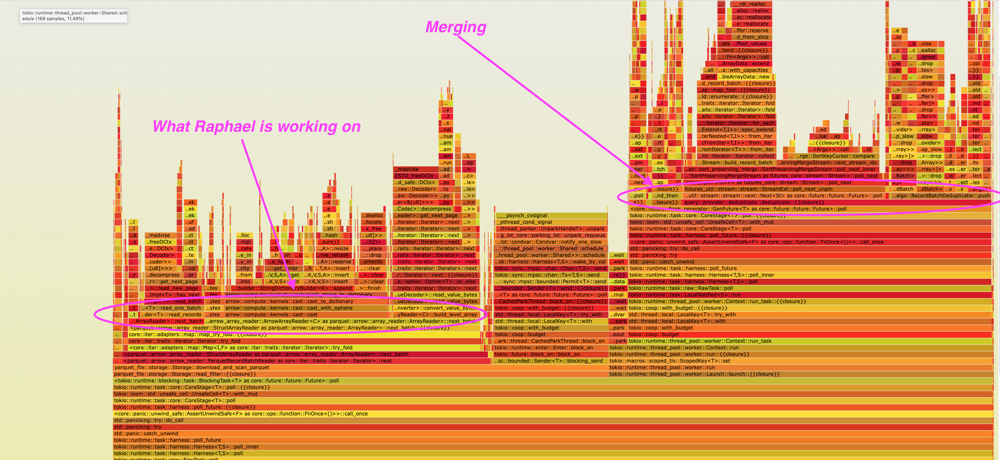

# Query Log Replay tool

Run queries that were run on production IOx systems against a local copy of that data for analysis / optimization


See background https://github.com/influxdata/conductor/issues/856

```shell
cargo build
```

And then see help with
```shell
./target/debug/query_replay_tool --help
```


# Caveats

I purposely chose be ~lazy~ efficient and not polish up this tool yet on the assumption I don't fully understand what will make it most useful. As I use it for actual analysis, I will polish / hone it more.

If it turns out to be useful, perhaps we can move it into the main `influxdb_iox` binary and treat it as a proper part of the stack

# Usage
You follow the instructions at https://github.com/influxdata/influxdb_iox/blob/main/docs/server_startup.md#creating-a-database-from-parquet-files to get parquet files from the system of interest.

Given these databases (`ab6ac6aa1fb6b962_b3f212db926c7897` is one I copied from production):

```shell
(arrow_dev) alamb@MacBook-Pro-2:~/Software/influxdb_iox$ ./target/debug/influxdb_iox database list
0000000000000001_0000000000000002
ab6ac6aa1fb6b962_b3f212db926c7897
query_log
```

You can then save the query log like this (or the equivalent command on kubernetes):

```shell
cargo run -p query_log_replay -- save ab6ac6aa1fb6b962_b3f212db926c7897  /tmp/queries.json
```

You can rerun the log like this:

```shell
cargo run -p query_log_replay -- replay 0000000000000001_0000000000000002  $HOME/Documents/production-scripts-aal/2021-12-15-list-queries.json
....
InfluxDB IOx Query Replay Tool... online
Connecting to http://127.0.0.1:8082
Replaying from 0000000000000001_0000000000000002 into database /Users/alamb/Documents/production-scripts-aal/2021-12-15-list-queries.json...
Loading queries from "/Users/alamb/Documents/production-scripts-aal/2021-12-15-list-queries.json"
Loaded query log with 13 entries
Ran StorageRpc(ReadFilter({   "ReadSource": {     "typeU)): 0 rows 0 frames in 1.808909ms
Ran StorageRpc(ReadFilter({   "ReadSource": {     "typeU)): 0 rows 0 frames in 1.170576ms
Ran StorageRpc(ReadFilter({   "ReadSource": {     "typeU)): 0 rows 0 frames in 1.23558ms
Ran StorageRpc(ReadFilter({   "ReadSource": {     "typeU)): 0 rows 0 frames in 994.017µs
Ran StorageRpc(ReadFilter({   "ReadSource": {     "typeU)): 0 rows 0 frames in 720.868µs
Ran StorageRpc(ReadFilter({   "ReadSource": {     "typeU)): 0 rows 0 frames in 806.631µs
Ran StorageRpc(ReadFilter({   "ReadSource": {     "typeU)): 0 rows 0 frames in 1.127923ms
Ran StorageRpc(ReadFilter({   "ReadSource": {     "typeU)): 0 rows 0 frames in 1.357889ms
Ran StorageRpc(ReadFilter({   "ReadSource": {     "typeU)): 0 rows 0 frames in 976.062µs
Ran Sql(select count(*), query_type fr): 2 rows 0 frames in 3.206296ms
Ran Sql(select * from system.queries): 11 rows 0 frames in 1.148663ms
Ran Sql(select * from system.queries): 12 rows 0 frames in 962.686µs
Ran Sql(select * from system.queries): 13 rows 0 frames in 948.075µs
Success
```

You can aim the same output at a different database as well (though the database needs to be named using InfluxDB style `orgid_bucket` as that is encoded directly in the gRPC requests

```shell
cargo run -p query_log_replay -- replay ab6ac6aa1fb6b962_b3f212db926c7897  $HOME/Documents/production-scripts-aal/2021-12-15-list-queries.json
warning: `query_log_replay` (bin "query_log_replay") generated 5 warnings
    Finished dev [unoptimized + debuginfo] target(s) in 6.71s
     Running `/Users/alamb/Software/iox-target/debug/query_log_replay replay ab6ac6aa1fb6b962_b3f212db926c7897 /Users/alamb/Documents/production-scripts-aal/2021-12-15-list-queries.json`
InfluxDB IOx Query Replay Tool... online
Connecting to http://127.0.0.1:8082
Replaying from ab6ac6aa1fb6b962_b3f212db926c7897 into database /Users/alamb/Documents/production-scripts-aal/2021-12-15-list-queries.json...
Loading queries from "/Users/alamb/Documents/production-scripts-aal/2021-12-15-list-queries.json"
Loaded query log with 13 entries
Ran StorageRpc(ReadFilter({   "ReadSource": {     "typeU)): 0 rows 0 frames in 3.881826ms
Ran StorageRpc(ReadFilter({   "ReadSource": {     "typeU)): 0 rows 0 frames in 3.165362ms
Ran StorageRpc(ReadFilter({   "ReadSource": {     "typeU)): 0 rows 0 frames in 3.201884ms
Ran StorageRpc(ReadFilter({   "ReadSource": {     "typeU)): 0 rows 0 frames in 1.155047996s
Ran StorageRpc(ReadFilter({   "ReadSource": {     "typeU)): 0 rows 0 frames in 1.1607068s
Ran StorageRpc(ReadFilter({   "ReadSource": {     "typeU)): 0 rows 28 frames in 1.11210894s
Ran StorageRpc(ReadFilter({   "ReadSource": {     "typeU)): 0 rows 0 frames in 3.821039ms
Ran StorageRpc(ReadFilter({   "ReadSource": {     "typeU)): 0 rows 12 frames in 1.144812695s
Ran StorageRpc(ReadFilter({   "ReadSource": {     "typeU)): 0 rows 44 frames in 1.105429295s
Ran Sql(select count(*), query_type fr): 2 rows 0 frames in 3.446229ms
Ran Sql(select * from system.queries): 70 rows 0 frames in 2.550267ms
Ran Sql(select * from system.queries): 71 rows 0 frames in 4.485453ms
Ran Sql(select * from system.queries): 72 rows 0 frames in 2.027104ms
Success
```


Which among other things allows for local analysis of where time was going during query, by using whatever tool you want (e.g. the built in `/debug/pprof` profiler):

